<h1>Active Directory Home Lab</h1>

 ### 

<h2>Description</h2> This lab demonstrates how to build a Windows Server Active Directory (AD) environment using virtual machines. It covers installing AD, setting up network services, automating user creation, and joining a client machine to the domain.

<br />

<h2>Languages and Utilities Used</h2>

- <b>PowerShell</b> 
- <b>VirtualBox</b>

<h2>Environments Used </h2>

- <b>Windows 10</b>
- <b>Windows Server 2022</b>
 
</p>


## 📝 Lab Overview

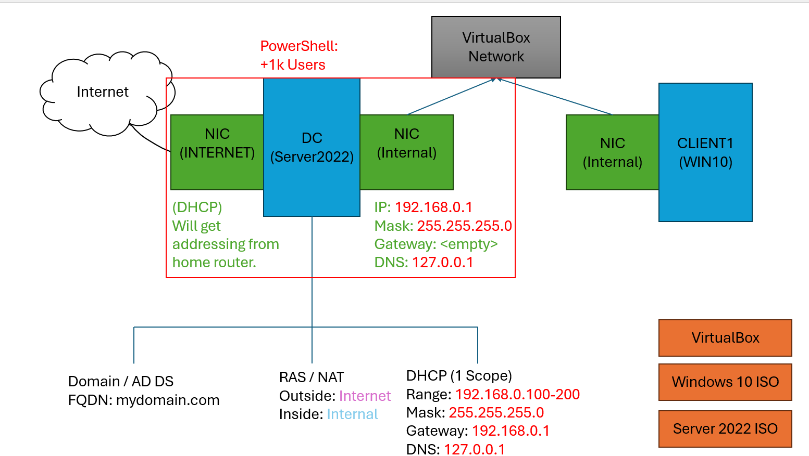

The lab walks through:

1. Assigning a **static IP** to the server’s internal interface.
2. Installing **Active Directory Domain Services (AD DS)** role.
3. Creating a **new forest and domain** (`mydomain.com`).
4. Organizing resources by creating **Organizational Units (OUs)**.
5. Adding **user accounts** to Active Directory.
6. Installing **Remote Access (RAS)** with **NAT** for internet access.
7. Installing **DHCP** and creating a **scope of IP addresses**.
8. Configuring **default gateway and routing** for the network.
9. Automating **bulk user creation** via a PowerShell script.
10. Setting up a **Windows client VM** and joining it to the domain.
11. Verifying domain membership with `whoami`.

By the end, you have a **fully functional AD environment** with DHCP, DNS, NAT, and a client machine joined to your domain.

---

## 📸 Screenshots & Descriptions

### 1. Assigning IP to Internal Internet

Assigning a **static IP** to the server’s internal interface for reliable network services.
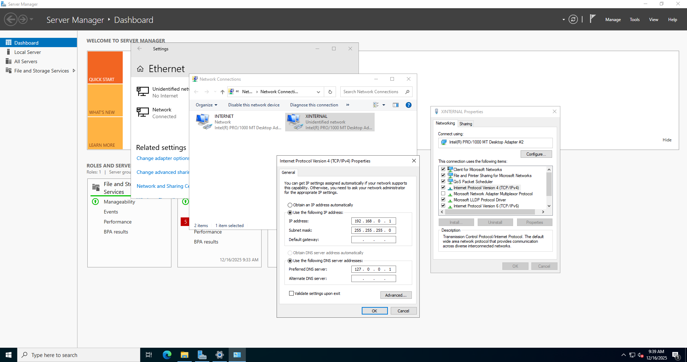

### 2. Installing Active Directory Domain Services

Adding the **AD DS role** through Server Manager, enabling the server to become a domain controller.
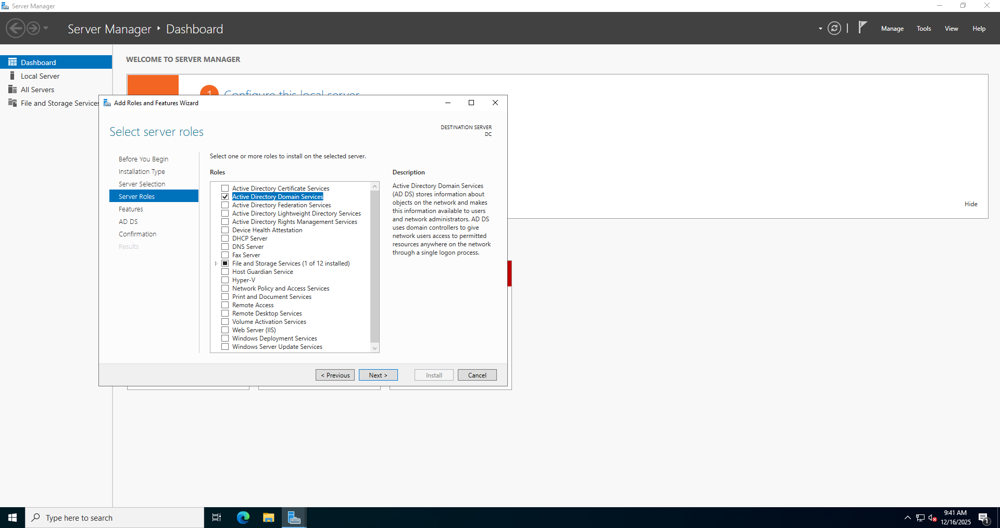

### 3. Adding a New Forest with mydomain.com

Creating a **new forest and domain** (`mydomain.com`) for your AD environment.
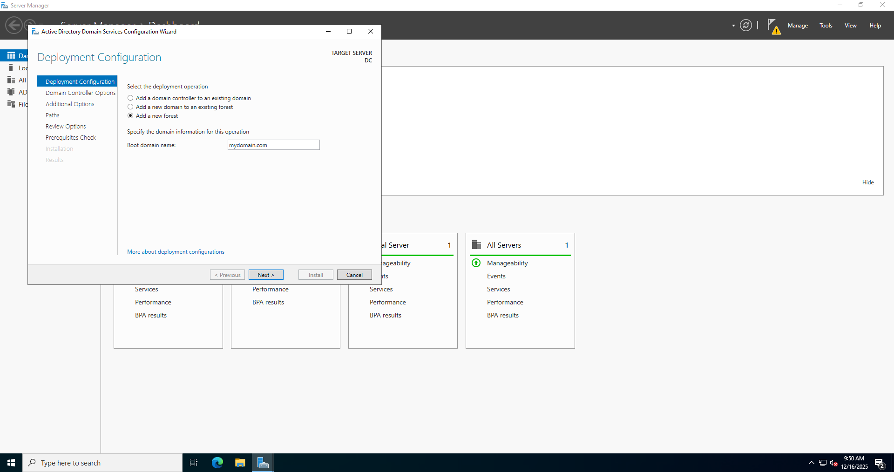

### 4. Creating an OU

Creating an **Organizational Unit (OU)** to organize users and computers logically in Active Directory.


### 5. Creating New Object User

Adding a **new user account** inside the OU.


### 6. Adding Remote Access RAS/NAT and Routing
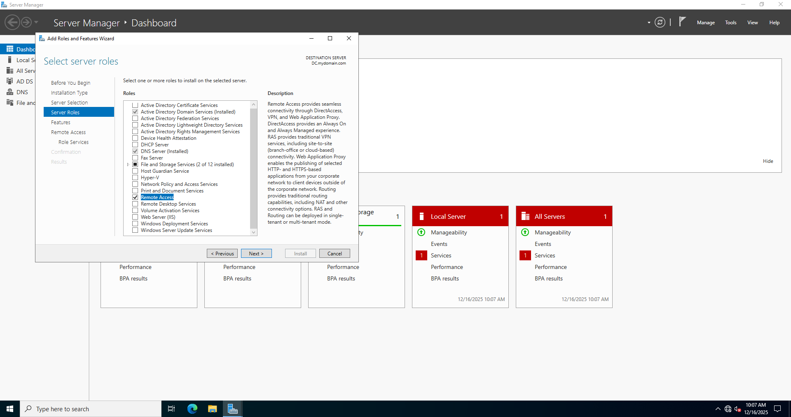<br><br>


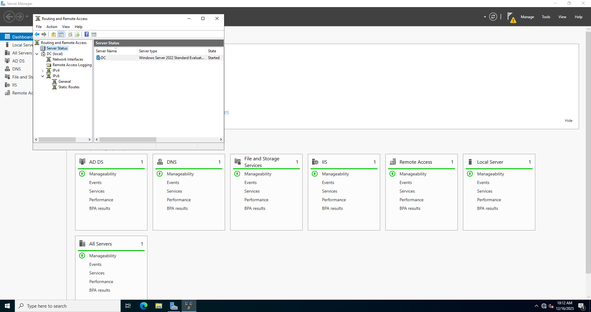

### 7. Adding DHCP Server

Installing the **DHCP Server role** to automatically assign IPs to client machines.


### 8. Creating a Scope of IP

Configuring a **DHCP scope** with a range of IP addresses, subnet mask, and lease duration.


### 9. Routing the Default Gateway

Setting the **default gateway and routing**, ensuring internal clients can reach external networks.


### 10. Running PowerShell Script for Automating 1000 User Creation

Using a **PowerShell script** to create a large number of AD user accounts automatically.


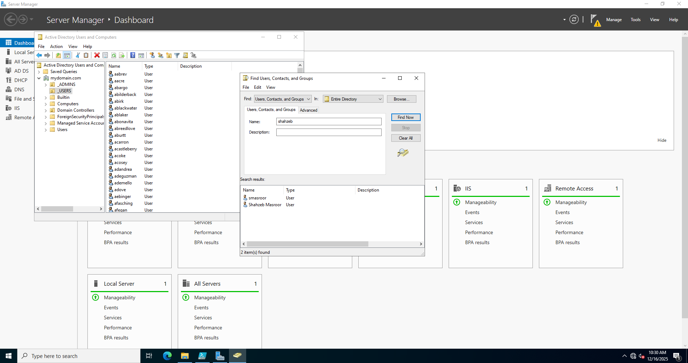

### 11. Creating Client PC

Setting up a **Windows client VM** to join the domain.
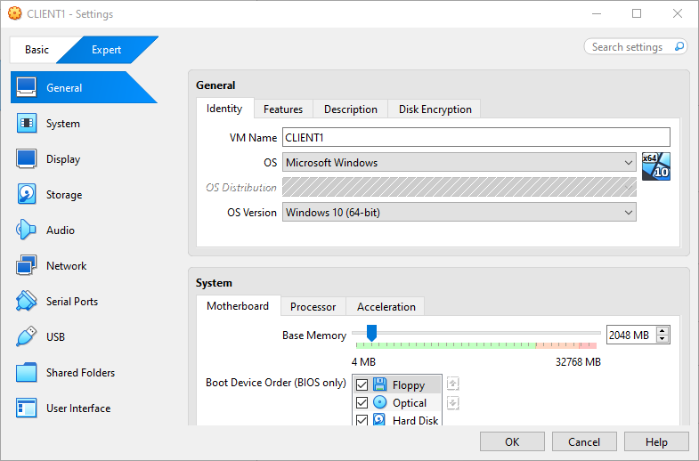


### 12. Domain Joining

Configuring the client to **join the `mydomain.com` domain**.


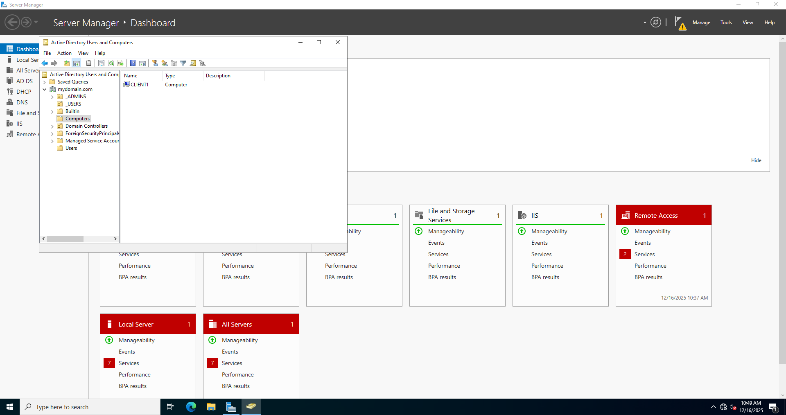


### 13. Proof of Domain Joining

Screenshot showing the client’s **login screen** with the domain, confirming successful join.
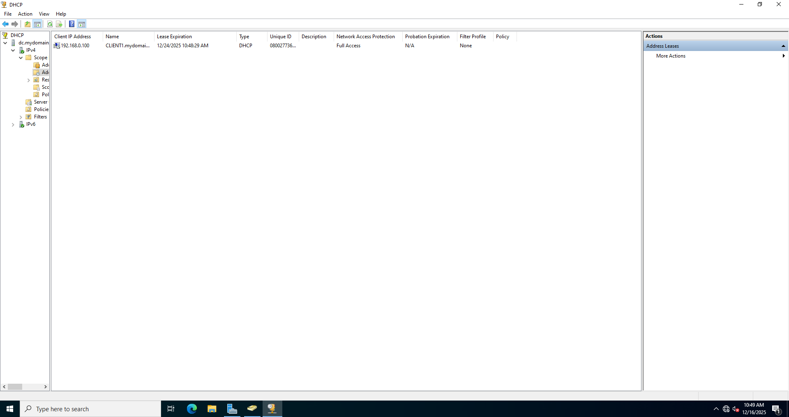

### 14. `whoami` in Command Prompt

Running `whoami` on the client to verify **logged-in user and domain context**.
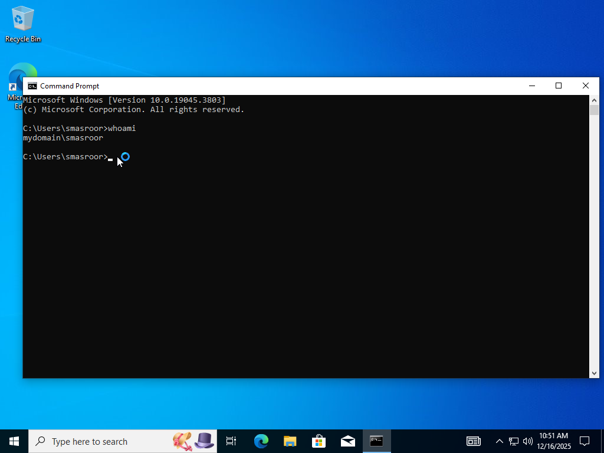


<!--
 ```diff
- text in red
+ text in green
! text in orange
# text in gray
@@ text in purple (and bold)@@
```
--!>
---


