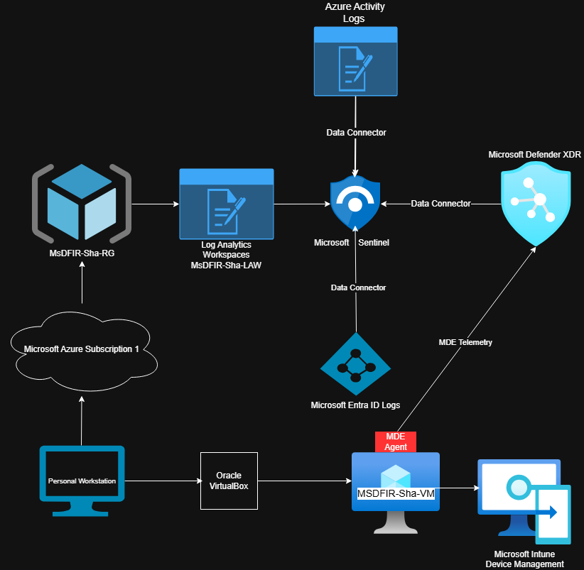

# 🟥🟩 
# 🟦🟨 30-Day Microsoft SOC Analyst Challenge

---

## Table of Contents

- [Purpose of This Challenge](#-purpose-of-this-challenge)
- [Project Overview](#-project-overview)
- [SOC Capability Map](#-soc-capability-map)
- [Repository Structure](#%EF%B8%8F-repository-structure)
  - [KQL Queries](#-kql-queries)
  - [Screenshots & Dashboards](#%EF%B8%8F-screenshots--dashboards)
  - [Phishing Simulations](#-phishing-simulations)
  - [Reports & Reflections](#-reports--reflections)   

---

## Purpose of This Challenge

- Learn cybersecurity by doing, not memorizing  
- Work directly with real systems, telemetry, and investigations  
- Develop practical SOC-level skills through hands-on projects  
- Demonstrate what a modern cloud SOC analyst actually does  
- Share the journey and lessons learned with others interested in cybersecurity  

---

## Project Overview

This repository documents a 30-day, hands-on Microsoft cloud SOC challenge focused on building and operating a real lab environment.

The project centers on designing a Microsoft-based SOC lab, onboarding security tooling, validating telemetry, and using that environment to conduct threat hunts, analyze phishing activity, investigate alerts, and produce incident-style reports.

The goal is to simulate how a real SOC environment operates and to capture the technical work, investigation process, and documentation that comes with it.

## Current Lab Environment

This section represents the current state of the SOC lab used as the foundation for all investigations and mini-projects.

*High-level view of the Microsoft-based SOC lab architecture and how endpoint, identity, and cloud telemetry flow into Sentinel for detection and investigation.*

### Resources Created So Far

**Cloud:** Azure Subscription, Resource Group (MsDFIR-Sha-RG), Log Analytics Workspace (MsDFIR-Sha-LAW), Azure Activity Logs  
**Security:** Microsoft Defender XDR, Microsoft Sentinel, Microsoft Entra-ID, Microsoft Intune
**Infrastructure:** Oracle VirtualBox, MSDFIR-Sha-VM

---

## 🔍 SOC Capability Map

| **🧰 Tools & Platforms** | **🧠 Security Skills Built** | **🏗️ Hands-On Outcomes** |
|:----------------------:|:--------------------------:|:---------------------:|
| Microsoft Azure | SOC lab design & deployment | Microsoft-based cloud SOC lab |
| Oracle VirtualBox | Environment building & validation | On-prem and test VM infrastructure |
| Entra ID | Identity & access investigation | Identity telemetry and sign-in activity analysis |
| Microsoft Sentinel | Log analytics, detection engineering, KQL hunting | Log ingestion, hunting queries, and analytics rules |
| Defender for Endpoint | Endpoint investigation & response | Endpoint telemetry, process, and alert investigations |
| Defender for Office 365 | Phishing and email analysis | Phishing investigations and email telemetry |
| MITRE ATT&CK | Adversary behavior mapping | Techniques mapped to investigations and reports |
| Microsoft Defender XDR | SOC detection & response workflows | Alert investigations and incident-style reports |
| Microsoft Intune | Device management & compliance | Endpoint enrollment, policy enforcement, and device configuration |
| - | Incident reporting & documentation | Incident-style reports and reflections |

---

## 🗂️ Repository Structure

### 🔎 KQL Queries  
➡️ [`/kql-queries`](./kql-queries)  
Threat hunting queries, investigation pivots, detection experiments

---

### 🖼️ Screenshots & Dashboards  
➡️ [`/screenshots-dashboards`](./screenshots-dashboards)  
Dashboards, alerts, timelines, visual evidence

---

### 📧 Phishing Simulations  
➡️ [`/phishing-simulations`](./phishing-simulations)  
Phishing investigations, header analysis, simulation exercises

---

### 📝 Reports & Reflections  
➡️ [`/reports-reflections`](./reports-reflections)  
Incident-style reports, challenge writeups, lessons learned

---

