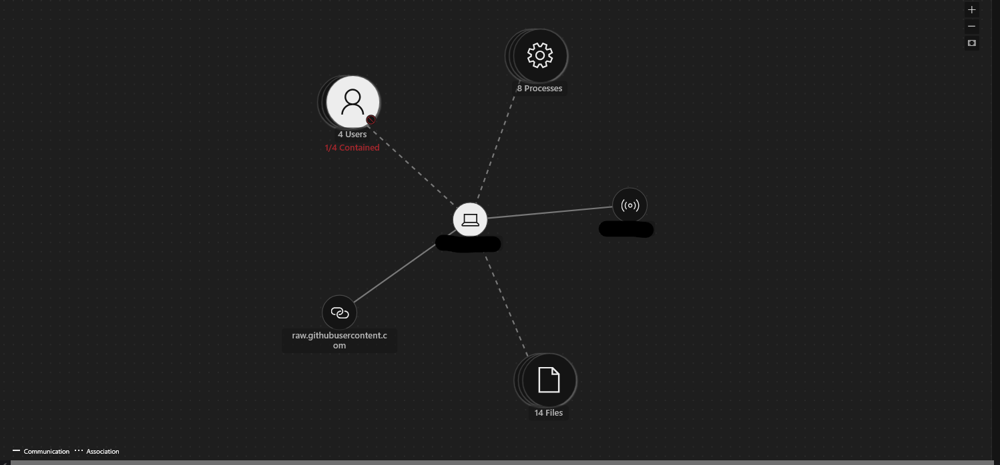
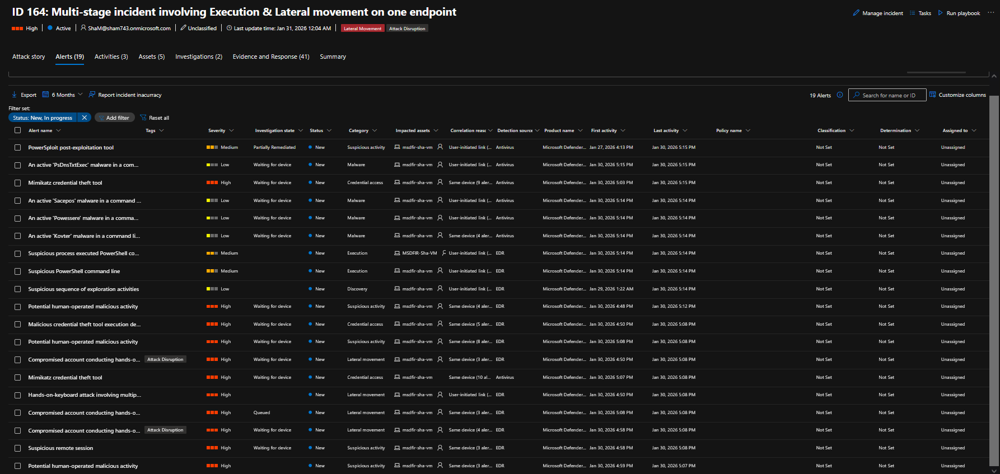

# Week 4 Reflection

- What I learned most was how **Microsoft's security tools work together** as a **unified security stack**.
  - **Sentinel, Defender for Endpoint, Defender for Office 365, and Entra ID** all feed into each other to provide complete visibility.
- Learned how to write **KQL queries** to investigate real security events like **failed logons, phishing attempts, and endpoint alerts**.
  - Explored how to **configure and test email security policies** (Safe Links, Anti-Phishing) and validate them by simulating attacks.
- I now feel **confident triaging alerts** and conducting basic investigations across **endpoint, email, and identity** data sources.
  - At the same time, I recognize I need more practice with **advanced KQL** and **cross-domain correlation** to handle complex attack scenarios.

*Attack Story for a Mult-Stage Incident*

---

### What would I do differently next time:
  
  - I want to simulate **more varied attack types** beyond phishing, such as:
    - Ransomware scenarios
    - Lateral movement patterns
    - Privilege escalation attempts
    - Endpoint-based persistence mechanisms
  - I would set up **more aggressive alerting thresholds** to practice tuning detections and reducing false positives.
  - Spend more time on **advanced correlation logic** to track multi-stage attacks across the entire kill chain.

*Investigating a Multi-Stage Incident using telemtry from multiple sources*

---

### How my confidence and skills changed:
  - I went from being **unfamiliar with KQL** to writing **functional queries independently**.
  - I'm now comfortable **navigating Microsoft Defender XDR** and understanding how alerts flow through the system.
  - I can **document findings in structured SOC reports** and map incidents to **MITRE ATT&CK tactics and techniques**.
  - Most importantly, I feel **prepared to contribute in an entry-level SOC role** and continue learning on the job.
