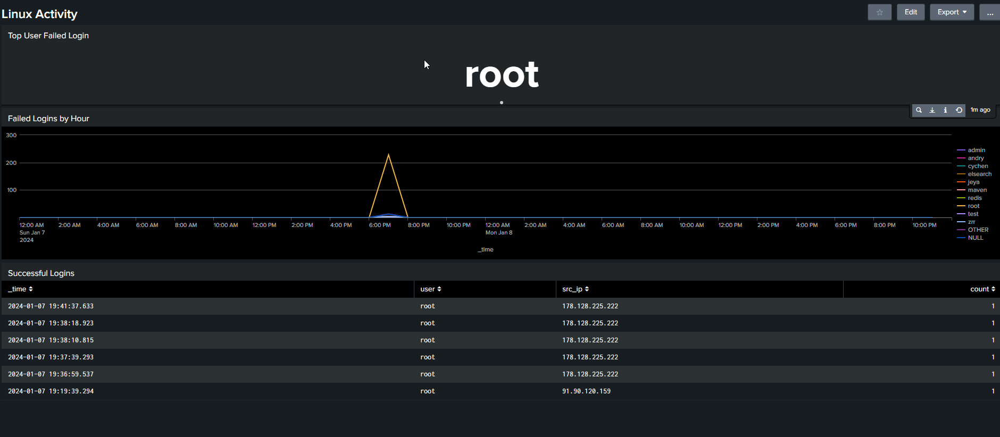

<div align="center">

# 🔍 Splunk SOC Investigation
### Multi-Stage Cyberattack Analysis

**Capstone Project** | Splunk 101 for SOC Analysts — MYDFIR

---



*Custom Dashboard: Failed Login Analysis & Successful Authentication Tracking*

---

</div>

## 🛠️ Technical Infrastructure
```
Windows Endpoints → Universal Forwarders → Splunk Indexers → Search Head → Dashboards & Alerts
```

**Built from scratch:**
- ✅ Deployed Splunk Enterprise on Ubuntu VM
- ✅ Configured Universal Forwarders on Windows endpoints  
- ✅ Set up indexers for Windows Security, Sysmon, and network logs
- ✅ Created custom dashboards and scheduled reports
- ✅ Configured real-time alerts for threat detection

---

## 📋 Investigation Summary

**Scenario:** Suspicious activity reported on FRONTDESK-PC1 administrative workstation

**Analysis:** Investigated multi-stage attack across 843 security events

**Attack Chain:** Brute Force → Malware Deployment → C2 Communication → Persistence

**Critical Discovery:** Zero-detection malware (0/59 VirusTotal) deployed via compromised admin account, established Command & Control to UK server, disabled Windows Defender

---

## ⏱️ Attack Timeline

| Time (UTC) | Event | Severity |
|------------|-------|----------|
| `12:51:44` | Brute force attack begins (157 failed logins) | 🟡 Medium |
| `12:52:54` | Account compromise: ryan.adams | 🔴 High |
| `12:55:50` | Windows Defender disabled | 🔴 Critical |
| `12:57:00` | python.exe downloaded | 🔴 High |
| `13:00:33` | Malware executed | 🔴 Critical |
| `13:00:34` | C2 connection to 157.245.46.190:8888 (UK) | 🔴 Critical |
| `13:04:59` | Persistence via scheduled task | 🔴 Critical |


---

## 🚨 Indicators of Compromise (IOCs)

<table>
<tr>
<td><b>Malware File</b></td>
<td><code>C:\Users\Ryan.Adams\Music\python.exe</code></td>
</tr>
<tr>
<td><b>SHA-256 Hash</b></td>
<td><code>CFFAB896E9F0B12101034D9CED76332EF5AA4036AFA08E940E825E277C21A044</code></td>
</tr>
<tr>
<td><b>C2 Server</b></td>
<td><code>157.245.46.190:8888</code> (DigitalOcean - UK)</td>
</tr>
<tr>
<td><b>Persistence</b></td>
<td>Scheduled Task "PythonUpdate" (SYSTEM privileges)</td>
</tr>
<tr>
<td><b>VirusTotal</b></td>
<td>0/59 detections (custom malware)</td>
</tr>
</table>

---

## 🎯 MITRE ATT&CK Framework

| Technique ID | Name | Evidence |
|--------------|------|----------|
| **T1110.001** | Brute Force: Password Guessing | 157 failed login attempts |
| **T1105** | Ingress Tool Transfer | python.exe download |
| **T1053.005** | Scheduled Task/Job | PythonUpdate persistence |
| **T1562.001** | Impair Defenses | Defender disabled |
| **T1071.001** | Application Layer Protocol | C2 over port 8888 |

---

## 💻 Sample SPL Queries

**Detect Brute Force Attacks:**
```spl
index="sha-soc" EventCode=4625 
| stats count by TargetUserName, src_ip 
| sort -count
```

**Hunt External Network Connections:**
```spl
index="sha-soc" EventCode=3 
| search NOT (DestinationIp="172.16.*" OR DestinationIp="10.*")
| table _time, Image, DestinationIp, DestinationPort
```

---

## 📂 Repository Contents

<div align="center">

| File | Description |
|------|-------------|
| **[capstone_report.md](capstone_report.md)** | Complete incident report with 5W1H analysis |
| **[spl_queries.md](spl_queries.md)** | Full collection of SPL queries used |
| **[screenshots/](screenshots/)** | Evidence and dashboard screenshots |

</div>

---

<div align="center">

**Skills Demonstrated**

`Splunk Enterprise` • `SIEM Analysis` • `Threat Hunting` • `Log Correlation` • `Incident Response` • `MITRE ATT&CK` • `SPL Queries` • `Dashboard Creation` • `Alert Configuration`

---

*Hands-on capstone demonstrating SOC infrastructure deployment and security analysis capabilities*

</div>
