# Splunk Capstone

# SOC Incident Report - FRONTDESK-PC1 Compromise

**Incident Date:** October 15, 2025

---

## Affected Systems

**Host:** FRONTDESK-PC1

**User:** Ryan.Adams

**Host IP:** 172.16.0.110

**IOC Host:** DESKTOP-924H12

**IOC Internal IP's:** 172.16.0.184, 172.16.0.7

**IOC External C2 IP:** 157.245.46.190 (UK - DigitalOcean)

---

## Indicators of Compromise (IOCs)

**File IOCs:**

- python.exe
- SHA 256: CFFAB896E9F0B12101034D9CED76332EF5AA4036AFA08E940E825E277C21A044

**Registry IOC:**

- HKLM\SOFTWARE\Microsoft\Windows NT\CurrentVersion\Schedule\TaskCache\Tree\PythonUpdate\Index registry_value_data 0x00000001

---

## Investigation

On 2025-10-15 12:51:44 UTC WindowsSecurity logs identified a stream of failed logon attempts on FRONTDESK-PC1, eventually gaining access to the user account Ryan.Adams at 2025-10-15 12:52:54 from an IP address of 172.16.0.184, this had the characteristics of a Brute Force Password Attack. At 2025-10-15 12:55:50 Windows Defender was disabled so the malware could be downloaded without detection. The attacker then launched chrome.exe and downloaded a suspicious file named python.exe being. This was then executed and reached out to an external IP of 157.245.46.190 (Location: United Kingdom). After this Powershell.exe was found executing a command to create a scheduled task to run python.exe on every system start up. 

User Ryan.Adams was logged off at 2025-10-15 13:06:40 and then the SYSTEM account was logged on with special privilleges at 2025-10-15 13:06:41 from host FRONTDESK-PC1 as well. This could potentially be signs of lateral movement or a legitimate login, there was no indication of what actions the SYSTEM account conducted once logged in. I then checked if there were similar actions taken on other accounts and hosts but could not find any evidence of such.

---

## 5W1H

**Who:**

Hostname: FRONTDESK-PC1

Host IP: 172.16.0.110

User: Ryan.Adams

IOC Host: DESKTOP-924H12

IOC Internal IP's: 172.16.0.184, 172.16.0.7

IOC External C2 IP: 157.245.46.190

**What:**

Brute Force Password Attack leading to successful login, downloaded and executed python.exe and then connected to a external IP located in the UK. Powershell.exe then created a scheduled task named PythonUpdate that would run Python.exe on every system startup.

**When:**

Initial Brute Force Attack: 2025-10-15 12:51:44.

Initial Successful Login: 2025-10-15 12:52:54.

Python.exe executed: 2025-10-15 13:00:33.

**Where:**

Hostname: FRONTDESK-PC1

User: Ryan.Adams

Host IP: 172.16.0.110

**Why:**

Based on the evidence, the exact motive is unknown beyond wanting to gain system access and observing persistence techniques and potential lateral movement.

**How:**

Attacker failed 157 login attempts.

Attacker gained access to FRONTDESK-PC1, source ip, 172.16.0.110, user Ryan.Adams on 2025-10-15 12:52:54.

Attacker disabled Microsoft Defender Antivirus Real-time Protection scanning for malware and other potentially unwanted software at 2025-10-15 12:55:50.

Attacker downloaded python.exe to C:\Users\Ryan.Adams\Music\python.exe from parent process chrome.exe.

Attacker then executed python.exe and connected to a C2 IP 157.245.46.190 (United Kingdom) over port 8888.

Attacker then used powershell.exe and created a scheduled task named PythonUpdate that would run Python.exe with elevated privileges on startup.

Attacker logged off Ryan.Adams and then the SYSTEM account was observed being logged on a second later but it's unknown if this was the attacker.

---

## Recommendations

1. Immediately isolate FRONTDESK-PC1 to try and prevent the attacker from moving laterally.
2. Force Password reset for Ryan.Adams and look at password policies and MFA configuration.
3. Restore FRONTDESK-PC1 from a backup prior to the incident.
4. Locate where host DESKTOP-924H12 is at it's on the same internal network and started the brute force. Once identified also isolate this device.
5. Block the C2 IP 157.245.46.190.

---

## Attack Timeline

2025-10-15 12:51:44 157 failed attempts on administrator, guest, andrew.henderson and Ryan.Adams from DESKTOP-924H12 at ip 172.16.0.184 to host FRONTDESK-PC1, user Ryan.Adams.

2025-10-15 12:52:54 Successful login on Ryan.Adams from DESKTOP-924H12 at ip 172.16.0.184.

2025-10-15 12:55:50 Attacker disabled Microsoft Defender Antivirus Real-time Protection scanning for malware and other potentially unwanted software.

2025-10-15 12:57:00 created C:\Users\Ryan.Adams\Music\python.exe process_exec chrome.exe.

2025-10-15 13:00:33 Command Line "C:\Users\Ryan.Adams\Music\python.exe".

2025-10-15 13:00:34 Python.exe connecting from host FRONTDESK-PC1, source ip, 172.16.0.110, user Ryan.Adams to 172.16.0.7 over port 135 on user account Ryan.Adams.

2025-10-15 13:00:34 Python.exe connecting from host FRONTDESK-PC1, source ip, 172.16.0.110, user Ryan.Adams to 157.245.46.190 over port 8888 on user account Ryan.Adams.

2025-10-15 13:00:35 Python.exe connecting from host FRONTDESK-PC1, source ip, 172.16.0.110, user Ryan.Adams to 172.16.0.7 over port 49669 on user account Ryan.Adams.

2025-10-15 13:04:08 Command Line "PowerShell.exe" -noexit -command Set-Location -literalPath 'C:\Users\Ryan.Adams\Music'.

2025-10-15 13:04:59 "C:\Windows\system32\schtasks.exe" /create /tn PythonUpdate /tr C:\Users\Ryan.Adams\Music\python.exe /sc onstart /ru SYSTEM /f *parent process powershell.exe*.

2025-10-15 13:04:59 pythonupdate created, located in C:\Windows\System32\Tasks\PythonUpdate.

2025-10-15 13:04:59 Sysmon Event Code 13 RegistryValue set HKLM\SOFTWARE\Microsoft\Windows NT\CurrentVersion\Schedule\TaskCache\Tree\PythonUpdate\Index registry_value_data 0x00000001.

2025-10-15 13:05:06 powershell.exe creates C:\Users\Ryan.Adams\AppData\Local\Microsoft\Windows\PowerShell\StartupProfileData-Interactive.

2025-10-15 13:05:53 Updated Windows Defender status successfully to SECURITY_PRODUCT_STATE_SNOOZED.

2025-10-15 13:06:40 Security Event ID 4634 An account was logged off (Ryan.Adams).

2025-10-15 13:06:41 Special prvileges assigned to new logon, Event ID 4672, user SYSTEM.

2025-10-15 13:06:41 Event 4624, SYSTEM account succesfully logged from host FRONTDESK-PC1.

---

## Investigation Findings - Appendix

---

**Timestamp:** 2025-10-15 12:51:44 to 12:52:57

**Query:**

```
index="sha-soc" extracted_host="FRONTDESK-PC1" EventCode=4625

```

**Evidence:**
157 failed login attempts on administrator, guest, andrew.henderson and Ryan.Adams from DESKTOP-924H12 (172.16.0.184) to host FRONTDESK-PC1, user Ryan.Adams

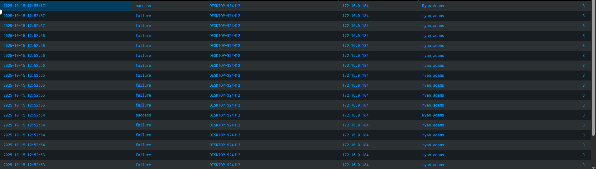

---

**Timestamp:** 2025-10-15 12:52:54 and 12:55:17

**Query:**

```
index="sha-soc" extracted_host="FRONTDESK-PC1" Workstation_Name="DESKTOP-924H12" action=* src_ip=*
| table _time, action, Workstation_Name, src_ip, user, Logon_Type
| sort -_time

```

**Evidence:**
Successful login on Ryan.Adams at 2025-10-15 12:52:54 and 2025-10-15 12:55:17 from DESKTOP-924H12 at ip 172.16.0.184, LogonType 3

---

**Timestamp:** 2025-10-15 12:55:50

**Query:**

```
index=sha-soc earliest="10/15/2025:12:55:49" latest="10/15/2025:12:55:51" extracted_host="FRONTDESK-PC1" defender
```

**Evidence:**
Microsoft Defender Antivirus Real-time Protection scanning for malware and other potentially unwanted software was disabled.

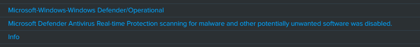

---
**Timestamp:** 2025-10-15 12:57:00

**Query:**

```
index="sha-soc" extracted_host="FRONTDESK-PC1" (user="Ryan.Adams" OR User="KCD\\Ryan.Adams") earliest="10/15/2025:12:45:00" latest="10/15/2025:13:15:00" EventCode=11 source="sysmon.csv" sourcetype="WinEvent:Sysmon"
| table _time, TargetFilename, action, file_name, file_path, process_exec, signature
| sort _time

```

**Evidence:**
Created C:\Users\Ryan.Adams\Music\python.exe, process_exec: chrome.exe

 

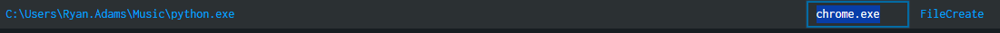

---

**Timestamp:** 2025-10-15 13:00:33

**Query:**

```
index="sha-soc" extracted_host="FRONTDESK-PC1" (user="Ryan.Adams" OR User="KCD\\Ryan.Adams") earliest="10/15/2025:12:45:00" latest="10/15/2025:13:15:00" EventCode=1 source="sysmon.csv" sourcetype="WinEvent:Sysmon"
| table _time parent_process_exec process_exec
| sort +_time

```

**Evidence:**
Command Line: "C:\Users\Ryan.Adams\Music\python.exe"

 

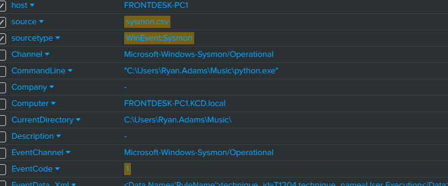

---

**Timestamp:** 2025-10-15 13:00:34

**Query:**

```
index="sha-soc" host="FRONTDESK-PC1" src_ip="172.16.0.110" python

```

**Evidence:**
Python.exe connecting from host FRONTDESK-PC1, source ip 172.16.0.110, user Ryan.Adams to 172.16.0.7 over port 135

 

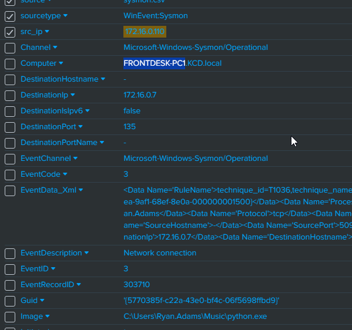

---

**Timestamp:** 2025-10-15 13:00:34

**Query:**

```
index="sha-soc" extracted_host="FRONTDESK-PC1" (user="Ryan.Adams" OR User="KCD\\Ryan.Adams") earliest="10/15/2025:12:45:00" latest="10/15/2025:13:15:00" EventCode=3 source="sysmon.csv" sourcetype="WinEvent:Sysmon"
| table _time process_exec src_port src_ip DestinationPort dest_ip user
| sort +_time

```

**Evidence:**
Python.exe connecting from host FRONTDESK-PC1, source ip 172.16.0.110, user Ryan.Adams to 157.245.46.190 over port 8888

 


---

**Timestamp:** 2025-10-15 13:00:35

**Query:**

```
index="sha-soc" host="FRONTDESK-PC1" src_ip="172.16.0.110" python

```

**Evidence:**
Python.exe connecting from host FRONTDESK-PC1, source ip 172.16.0.110, user Ryan.Adams to 172.16.0.7 over port 49669

 

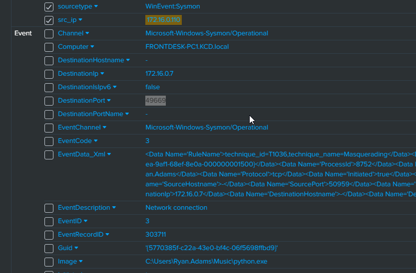

---

**Timestamp:** 2025-10-15 13:04:08

**Query:**

```
index="sha-soc" extracted_host="FRONTDESK-PC1" (user="Ryan.Adams" OR User="KCD\\Ryan.Adams") earliest="10/15/2025:12:45:00" latest="10/15/2025:13:15:00" EventCode=1 source="sysmon.csv" sourcetype="WinEvent:Sysmon" process_exec="powershell.exe"

```

**Evidence:**
Command Line: "PowerShell.exe" -noexit -command Set-Location -literalPath 'C:\Users\Ryan.Adams\Music'

 

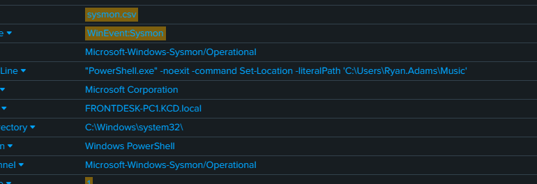

---

**Timestamp:** 2025-10-15 13:04:59

**Query:**

```
index="sha-soc" extracted_host="FRONTDESK-PC1" earliest="10/15/2025:13:04:00" latest="10/15/2025:13:06:44" sourcetype="WinEvent:Sysmon" EventCode=1
| table _time, process, CommandLine, parent_process_exec

```

**Evidence:**
"C:\Windows\system32\schtasks.exe" /create /tn PythonUpdate /tr C:\Users\Ryan.Adams\Music\python.exe /sc onstart /ru SYSTEM /f, parent process: powershell.exe

 


---

**Timestamp:** 2025-10-15 13:04:59

**Query:**

```
index="sha-soc" extracted_host="FRONTDESK-PC1" earliest="10/15/2025:13:04:00" latest="10/15/2025:13:06:44" sourcetype="WinEvent:Sysmon"
| sort -_time

```

**Evidence:**
PythonUpdate scheduled task created, located in C:\Windows\System32\Tasks\PythonUpdate

 


---

**Timestamp:** 2025-10-15 13:04:59

**Query:**

```
index="sha-soc" extracted_host="FRONTDESK-PC1" earliest="10/15/2025:13:04:00" latest="10/15/2025:13:06:44" sourcetype="WinEvent:Sysmon"
| sort -_time

```

**Evidence:**
Sysmon Event Code 13 RegistryValue set HKLM\SOFTWARE\Microsoft\Windows NT\CurrentVersion\Schedule\TaskCache\Tree\PythonUpdate\Index, registry_value_data: 0x00000001

 

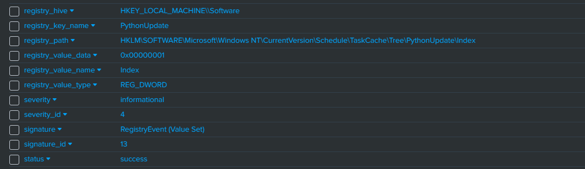

---

**Timestamp:** 2025-10-15 13:05:06

**Query:**

```
index="sha-soc" extracted_host="FRONTDESK-PC1" earliest="10/15/2025:13:04:00" latest="10/15/2025:13:06:44" sourcetype="WinEvent:Sysmon"
| sort -_time

```

**Evidence:**
powershell.exe creates C:\Users\Ryan.Adams\AppData\Local\Microsoft\Windows\PowerShell\StartupProfileData-Interactive

 

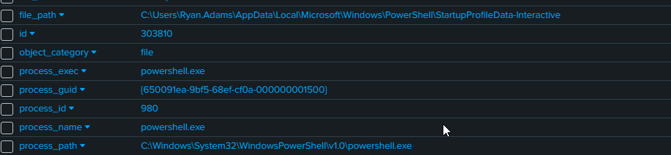

---

**Timestamp:** 2025-10-15 13:05:53

**Query:**

```
index="sha-soc" extracted_host="FRONTDESK-PC1" earliest="10/15/2025:13:04:00" latest="10/15/2025:13:06:44" sourcetype="WinEvent:Application"

```

**Evidence:**
Updated Windows Defender status successfully to SECURITY_PRODUCT_STATE_SNOOZED

 

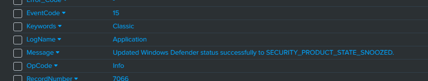

---

**Timestamp:** 2025-10-15 13:06:40

**Query:**

```
index="sha-soc" extracted_host="FRONTDESK-PC1" earliest="10/15/2025:13:04:00" latest="10/15/2025:13:06:44" sourcetype="WinEvent:Security"

```

**Evidence:**
Security Event ID 4634 An account was logged off (Ryan.Adams)

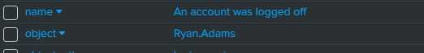

---

**Timestamp:** 2025-10-15 13:06:41

**Query:**

```
index="sha-soc" extracted_host="FRONTDESK-PC1" earliest="10/15/2025:13:04:00" latest="10/15/2025:13:06:44" sourcetype="WinEvent:Security"

```

**Evidence:**
Special privileges assigned to new logon, Event ID 4672, user SYSTEM

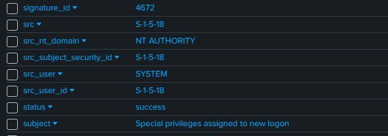

---

**Timestamp:** 2025-10-15 13:06:41

**Query:**

```
index="sha-soc" extracted_host="FRONTDESK-PC1" earliest="10/15/2025:13:04:00" latest="10/15/2025:13:06:44" sourcetype="WinEvent:Security"

```

**Evidence:**
Event 4624, SYSTEM account successfully logged from FRONTDESK-PC1

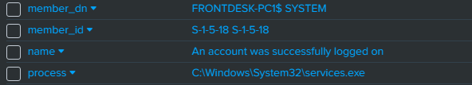
